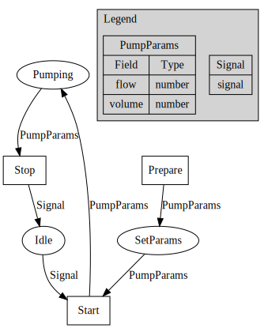

## Design components

The first step in designing a system with `Petri` is to define the components of the system with
petri nets.

Petri uses a `.yaml` file to define the components of the system. The `.yaml` file contains the schema for the tokens,
places, transitions, and arcs. Petri can then use this `.yaml` file to:

- Generate:
    1. A `.proto` file for the component describing its interface
    2. A `device.yaml` file for component metadata and configuration
    3. Boilerplate code for the component in the language of your choice
    4. A main file to run the component
    5. A Dockerfile to run the component in a container

- Discover devices on the network that implement the component

Instead of scaffolding the components with go, we can use a `Petrifile` to
define the components. The `Petrifile` is a yaml file that contains the schema
for the tokens, places, transitions, and arcs. The `Petrifile` can be used to
define systems and generate code for the components in a human-readable format.

### Switch



```yaml
petri: v1 # The version of the petri file format, required for all petri .yaml files
version: 0.1 # The version of the door petri net
name: switch # The name of the petri net

# Places are passive elements in the petri net describing conditions, states, or resources.
places:
  # [name]: [accepted token type(s)]
  on: signal
  off: signal

# Transitions are active elements in the petri net that can change the state of the system
transitions:
  # [name]:
  turnOn:
    # Setting event to true exposes the transition as an event. Without this, the transition will fire as soon as all
    # inputs are available, which is desirable in some cases but not here.
    event: true
    inputs: off # we can only turn the light on if it is off
    outputs: on # when we turn the light on, the `on` condition is met, and we put a signal token in the `on` place

  turnOff:
    event: true
    inputs: on
    outputs: off
```

### Light

```yaml
petri: v1
version: 0.1
name: light

places:
  shining: signal
  off: signal

transitions:
  illuminate:
    inputs: off
    outputs: shining

  extinguish:
    inputs: shining
    outputs: off

```

### Logger

```yaml
petri: v1
version: 0.1
name: logger

places:
  message: string

transitions:
  - log:
      # note that we are not setting event to true, so as soon as a message is in the input place we will fire this
      inputs: message
```

## Implement the devices

### Python: Switch

To generate the switch with `petri` and implement it in python:

```sh
petri generate switch.yaml --lang python 
```

this does a bunch of things to get you started on developing your switch. It:

1. Creates a python project with the same name as the `.yaml` file
   (note: We can pass a `--name` flag to specify a different name for the project since this will be the device name
   when we run our system.)
2. Downloads the petri python library
3. Generates the `proto/v1/switch.proto` file
4. Generates the `device.yaml` file
5. Creates a `Switch` class inside of `service.py` that implements an `AbstractSwitch` interface
6. Creates a `main.py` file that runs the switch service

All that needs to be done is to implement the `Switch` class in `service.py`:

```python
from switch.domain import model
from pypetri.singleton import singleton


# we use the singleton decorator to ensure that only one instance of the switch is created, no matter how many times
# the service is started.
@singleton
class Switch(model.AbstractSwitch):
    def turn_on(self):
        # turn the switch on. If this were a real switch, we would implement the actual
        # logic for turning a real switch on here, such as turning a GPIO pin on for a Raspberry Pi
        # or sending a command to a device over serial or a network. For now, we will just print
        # a message to the console.
        print("Switch turned on")

    def turn_off(self):
        # turn the switch off. 
        print("Switch turned off")

```

Let's take a look behind the scenes of the `AbstractSwitch` that was generated:

```python
from abc import ABC, abstractmethod
import threading


class AbstractSwitch(ABC):
    # we use a lock to ensure that only one thread can access the switch at a time. This way, we can expose the
    # switch over multiple interfaces and keep everything in sync.
    
    lock: threading.Lock = threading.Lock()

    # the turn_on and turn_off methods are abstract and are what we implemented above in the `Switch` class: 
    
    @abstractmethod
    def turn_on(self):
        raise NotImplementedError

    @abstractmethod
    def turn_off(self):
        raise NotImplementedError
        
            
    # The public API uses pascal case to define methods, in line with the code generated by protoc for the gRPC 
    # servicer
    def TurnOn(self):
        with self.lock:
            self.turn_on()
    
    
    def TurnOff(self):
        with self.lock:
            self.turn_off() 
```

And we are done coding the switch. We now have a fully communicative asynchronous switch service
that was defined with a simple `.yaml` file and a few lines of python code. The petri package
will take care of the rest.

To start it, we can run:

```sh
petri start switch
```

### Go: Light

Let's generate the light with `petri` and implement it in Go:

```sh
petri generate light.yaml --lang go
```

For go services, we get:

1. A go project
2. The petri go library
3. The `proto/v1/light.proto` file
4. The `device.yaml` file
5. A `model.go` file that defines the `Light` interface
6. A `service.go` file where the `Light` interface is implemented as a `Device` struct
7. A `main.go` file that runs the light service

A simple definition of the light service in `service.go`:

```go
package light

import (
	"context"
	"fmt"
	"github.com/jt05610/petri"
)

var _ petri.Light = &Device{}

type Device struct {
	petri.Device
}

func (d *Device) Illuminate(ctx context.Context) error {
	fmt.Println("Light is shining")
	return nil
}

func (d *Device) Extinguish(ctx context.Context) error {
	fmt.Println("Light is off")
	return nil
}
```

And the light service is ready to go. We can start it with:

```sh
petri start light
```

### Python: Logger

And finally, let's generate the logger with `petri` and implement it in python:

```sh
petri generate logger.yaml --lang python
```

```python
from logger.domain import model

@singleton
class Logger(model.AbstractLogger):
    def log(self, message: str):
        print(message)
```

## Join the components into a system for higher-level control

```yaml
petri: v1
version: 0.1
name: logging_light_switch

nets:
  light: light.yaml
  switch: switch.yaml
  logger: logger.yaml

links:
  - from: switch.on
    to: light.illuminate

  - from: light.illuminate
    to:
      - switch.on
      - logger.message: "on"

  - from: switch.off
    to: light.extinguish

  - from: light.extinguish
    to:
      - switch.off
      - logger.message: "off"

```

The system net we arrive at is


## Create an environment for the system

When we defined our system petri net above, we did so in abstract terms. This allows us to define our system independent
of its implementation.

We can describe different implementations of the same system by creating environments. An environment is a `.yaml` file
that maps petri net components to the unique identifier of the device that implements the component. This way, Petri
knows what device to send commands to when it is executing sequences.

```yaml
petri: v1
version: 0.1
environment: dev

light: lightID
switch: switchID
logger: loggerID
```

## Run the system

We can run the system with `petri`:

```sh
petri start logging_light_switch --env dev 
```

This will start a client application that will allow us to interact with the system.

