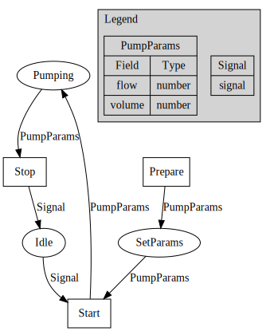

# Summary

Laboratories are composed of multiple systems that are often not designed to
work together, and the integration of these systems is a common challenge in
modern research laboratories. While significant advancements have been made in
developing sophisticated lab equipment and software, the ability to seamlessly
integrate these systems is often limited. This is particularly true in the
field of pharmaceutical sciences, where the need to integrate a wide variety of
systems, including liquid handling robots, plate readers, data analysis
scripts, and lab information management systems. Here, we present Petri, a
schema-first Go-based platform for systems integration that is designed to be
flexible, scalable, and easy to use. Petri provides a common interface to
describe systems and the relationships between components within the system.
With Petri, systems modeling and implementation are handled separately,
facilitating sharing systems and workflows between labs with completely
different equipment and software services, or allowing easy changing of one
service or piece of equipment with another.

# Statement of need

`Petri` is a Go-based service for integrating laboratory systems with each
other. Go enables 'Petri' to be fast, scalable, and with memory safety. The API
was designed to be schema-first, so that the focus while designing is on what
systems need to do, rather than the details of how they will do. This allows
great flexibility when implementing and sharing systems.  `Petri` has a code
generator that to generate code for components in the systems, and a runtime
that can be used to run the systems. `Petri` relies heavily on abstractions and
interfaces, so that it can be used with any kind of lab instrument or software
service, independent of the component's provided interface. A GraphQL API is
provided to interact with the runtime with a scripting language of the user's
choice, and a web-based interface is provided to design systems and sequences
of events.

`Petri` was designed to facilitate integration of DIY and commercially
available components with a variety of interfaces. It has been used in the
author's thesis work to integrate DIY and commercially available components to
automate lipid nanoparticle library preparation and characterization. The
ability to rapidly design and integrate systems with `Petri` will enable
researchers to develop efficient, reproducible, and sharable workflows that are
resistant to changes in lab members, equipment, and software services.

# Systems integration with Petri

To demonstrate the capabilities of `Petri`, we will use a simple example of
a two position valve and a pump. The hypothetical valve has two positions, A and
B. The Pump can pump with a set flow rate and volume.

## Design components

The first step in designing a system with `Petri` is to define the components

### Valve

```go


```

### Pump

#### Token Schema

```go
package main

import (
	"github.com/jt05610/petri"
)

// First, we will declare the schema for the tokens that the pump will use. It will use a signal to
// start and stop, and a `PumpParams` token to set the flow rate and volume.
func pumpTokens() []*petri.TokenSchema {
	return []*petri.TokenSchema{
		petri.Signal(),
		&petri.TokenSchema{
			ID:   petri.ID(),
			Name: "PumpParams",
			Type: "object",
			Properties: map[string]petri.Properties{
				"flow": {
					Type: "number",
				},
				"volume": {
					Type: "number",
				},
			},
		},
	}
}

// Next, we will declare the places that the pump will use. The pump will have three
// places, `Idle`, `SetParams`, and `Pumping`. The `Idle` place will have a signal
// token, the `SetParams` and `Pumping`places will accept a `PumpParams` token, and the `Pumping`
// place will have a `PumpParams` token.
func pumpPlaces() []*petri.Place {
	return []*petri.Place{
		petri.NewPlace("Idle", 1, petri.Signal()),
		petri.NewPlace("SetParams", 1, pumpParams),
		petri.NewPlace("Pumping", 1, pumpParams),
	}
}

// Then, we will declare the transitions that the pump will use. The pump will have
// three transitions, `Start`, `Stop`, and `Prepare`. The `Start` transition will
func pumpTransitions() []*Petri.Transition {
	return []*petri.Transition{
		petri.NewTransition("Start")),
		petri.NewTransition("Stop")),
		petri.NewTransition("Prepare")),
	}
}

// Finally, we will declare the net and its arcs that the pump will use. 

func pumpNet() *petri.Net {
	net := petri.NewNet("Pump").WithPlaces(pumpPlaces()...).WithTransitions(pumpTransitions()...)
	aa := []*petri.Arc{
		petri.NewArc(p.Net.Place("Idle"), p.Net.Transition("Start"), "Signal", signal),
		petri.NewArc(p.Net.Transition("Prepare"), p.Net.Place("SetParams"), "PumpParams", pumpParams),
		petri.NewArc(p.Net.Place("SetParams"), p.Net.Transition("Start"), "PumpParams", pumpParams),
		petri.NewArc(p.Net.Transition("Start"), p.Net.Place("Pumping"), "PumpParams", pumpParams),
		petri.NewArc(p.Net.Place("Pumping"), p.Net.Transition("Stop"), "PumpParams", pumpParams),
		petri.NewArc(p.Net.Transition("Stop"), p.Net.Place("Idle"), "Signal", signal),
	}
	return .WithArcs(aa...)
}

```

Petri also has provisions for representing the net as a graph with graphviz, and
allows exporting the net as a graphviz file.



## Implement the devices

These will be the simplest possible valve and pump implementations, the real implementations of these functions would
involve interfacing with the hardware over a serial or network connection rather than printing to the console.

## Valve

## Pump

```go

// Pump is a simple pump that pumps a volume of liquid at a given flow rate
type Pump struct {
Settings *PumpParams
petri.Marking
*petri.Net
startedAt time.Time
pumping   bool
}

// PumpParams is a struct that represents the parameters of the pump
type PumpParams struct {
Flow   float64 `json:"flow"`
Volume float64 `json:"volume"`
}

func (p *Pump) Stop(ctx context.Context, input interface{}) (int, error) {
p.pumping = false
return 0, nil
}

func (p *Pump) Prepare(ctx context.Context, input *PumpParams) (*PumpParams, error) {
p.Settings = input
return input, nil
}

func (p *Pump) Start(ctx context.Context, input interface{}) (*PumpParams, error) {
var err error
p.startedAt = time.Now()
p.pumping = true
go func () {
select {
case <-ctx.Done():
case <-time.After(time.Duration(1e9*p.Settings.Volume/p.Settings.Flow) * time.Nanosecond):
p.Marking, err = p.Net.Process(p.Marking, petri.Event[any]{
Name: "Stop",
Data: 1,
})
if err != nil {
panic(err)
}
}
}()
return p.Settings, nil
}
```

## Connect the components into a system

```go
```

## Create an environment with the components

```go

```

## 